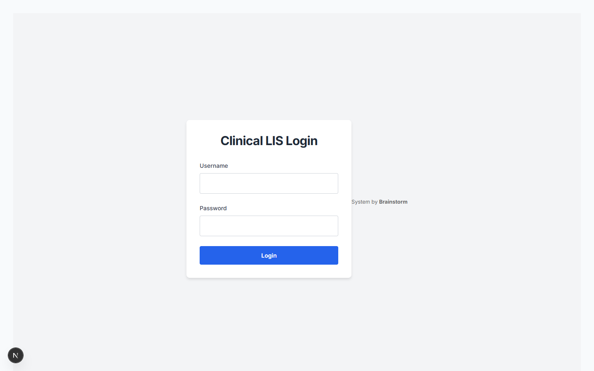
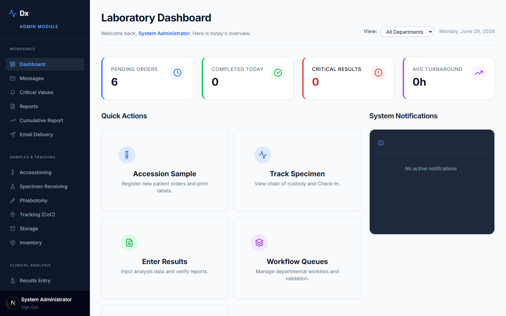
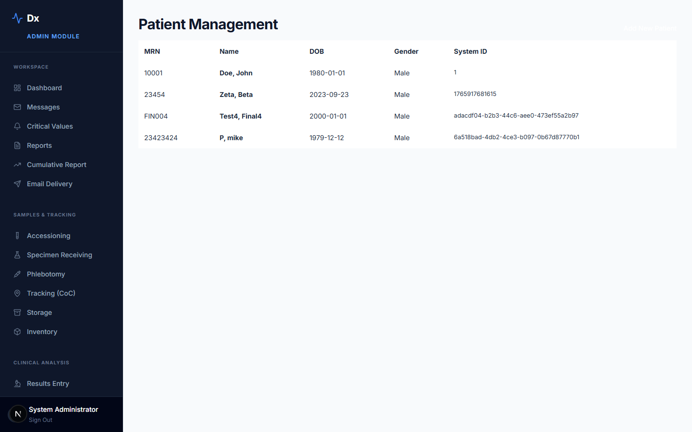
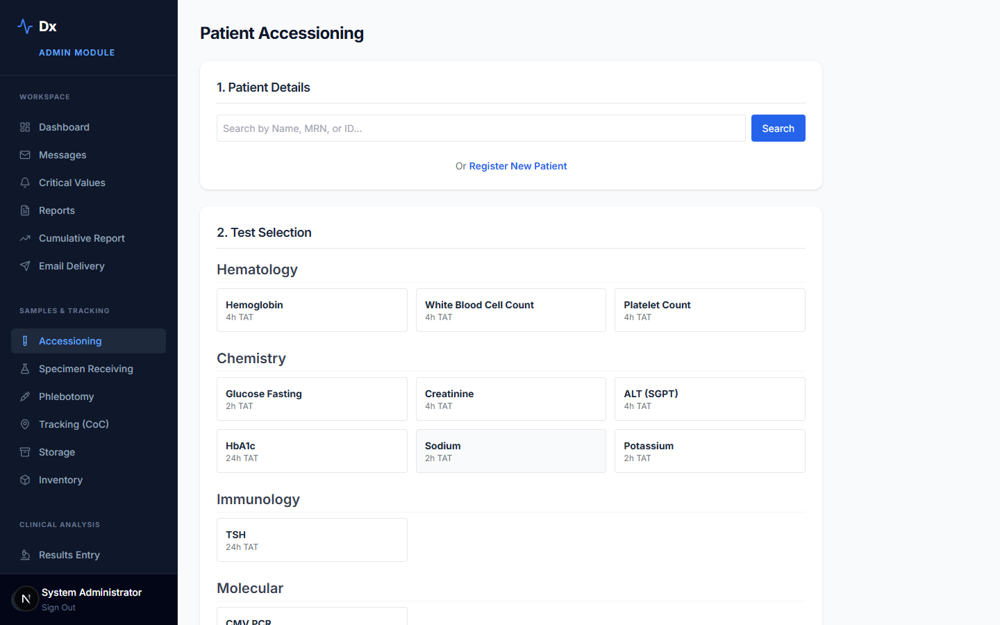
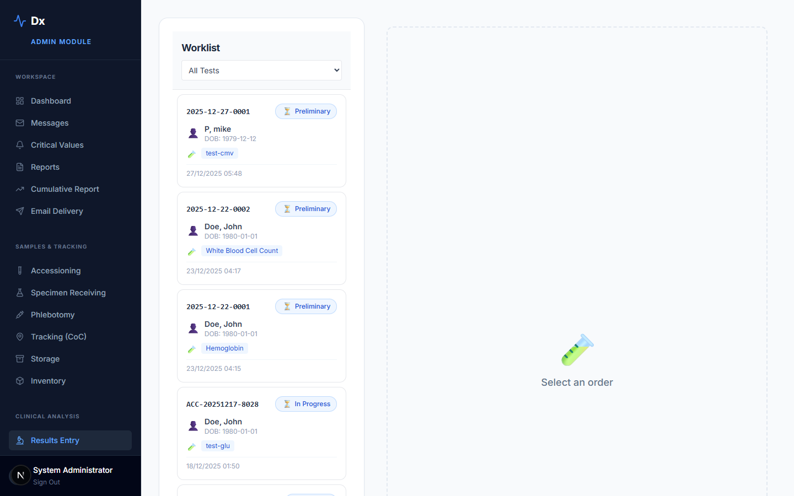
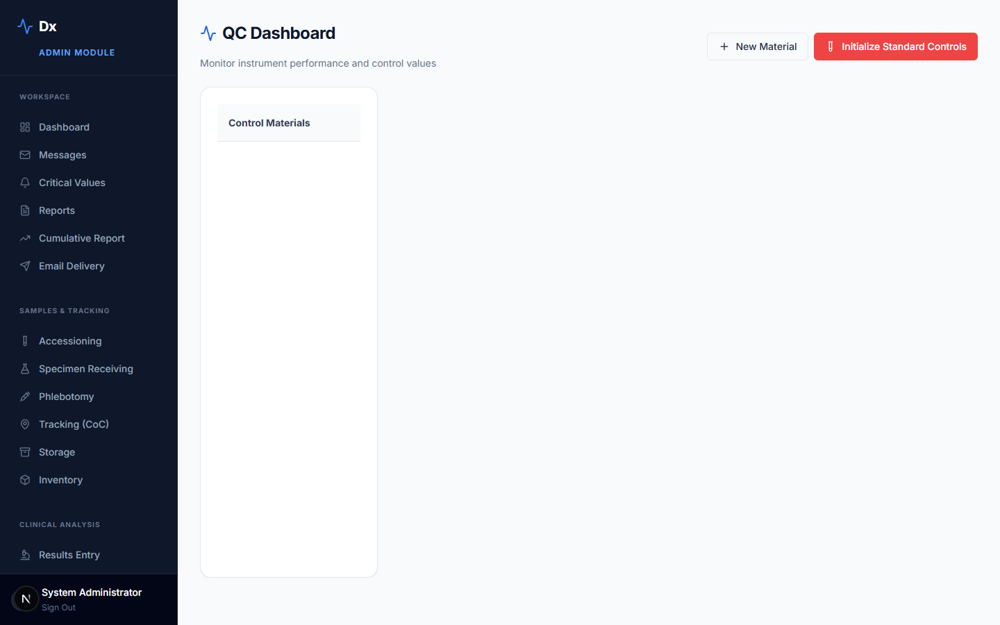
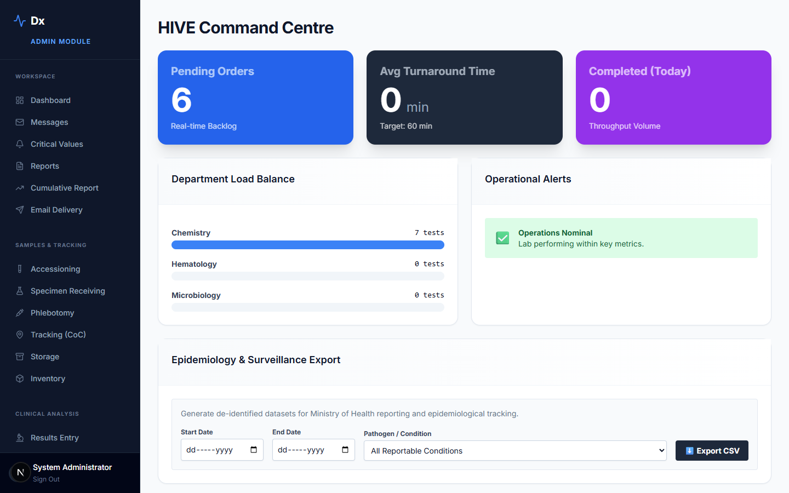

# Dx — Clinical Laboratory Information System

A full-featured, open-source Laboratory Information System (LIS) built with **Next.js 16** and **SQLite**. Covers the complete clinical laboratory workflow — from patient registration and order entry through specimen tracking, result entry, two-tier clinical validation, reporting, and billing.

---

## Screenshots

| Login | Dashboard |
|---|---|
|  |  |

| Patient List | Accessioning |
|---|---|
|  |  |

| Result Entry | QC Management |
|---|---|
|  |  |

| Analytics |
|---|
|  |

---

## Features

### Core Clinical Workflow
- **Patient Registration** — MRN-based patient records with full demographics and visit history
- **Order Entry** — multi-test orders with priority levels, department routing, and atomic accession number generation (YYYY-MM-DD-XXXX format)
- **Specimen Accessioning** — barcode label printing, specimen type tracking, chain of custody log
- **Result Entry** — manual result entry with reference range validation and result flag detection
- **Two-Tier Verification** — Technical Validation → Clinical Verification with electronic signatures
- **Report Generation** — cumulative patient reports, PDF printing via browser, email dispatch queue

### Clinical Decision Support (Clinical Engine)
- **Delta Checks** — automatic comparison of results against previous patient values with configurable thresholds
- **Critical Value Alerts** — real-time detection of panic values with mandatory acknowledgment workflow
- **Reflex Rules** — automatic add-on test ordering based on result conditions
- **Notifiable Disease Surveillance** — configurable positive result triggers for public health reporting

### Specialty Modules
- **QC Management** — Levey-Jennings charts, Westgard rule evaluation, QC material and lot tracking
- **Microbiology** — culture setup, incubation stage tracking, antibiotic susceptibility testing (AST)
- **Histology** — cassette/block/slide tracking with stain management
- **Phlebotomy** — mobile-optimized collection queue for phlebotomists (`/mobile/collections`)
- **Batch Entry** — spreadsheet-style result entry for high-throughput runs (`/worksheets/batch`)
- **Instrument Middleware** — HL7/ASTM-compatible ingest endpoint for LIS-instrument integration

### Administration & Compliance
- **RBAC** — five roles: `admin` › `manager` › `scientist` / `medic` › `clerk`
- **Department Management** — multi-department with independent test menus and routing rules
- **Inventory** — reagent/consumable tracking, lot numbers, expiry alerts, automatic stock deduction on result entry
- **Equipment Logs** — maintenance and calibration records
- **Billing** — CPT-4 billing item mapping, invoice generation, payment status tracking
- **Full Audit Trail** — every data mutation logged with user, timestamp, and before/after values
- **Record Locking** — optimistic checkout/checkin to prevent concurrent edits

### Analytics & Reporting
- **Live Dashboard** — pending orders, critical value queue, real-time TAT monitoring
- **TAT Monitor** — turnaround time tracking by test and department against configured thresholds
- **Epidemiology Module** — disease surveillance exports for public health reporting
- **Analytics** — test volume trends, department performance, CSV export
- **FHIR R4 Export** — HL7 FHIR R4 DiagnosticReport output for interoperability

---

## Tech Stack

| Layer | Technology |
|---|---|
| Framework | Next.js 16 (App Router) |
| Language | TypeScript 5 |
| UI | React 19, Tailwind CSS 3, Recharts |
| Database | SQLite via `better-sqlite3` |
| ORM | Drizzle ORM |
| Auth | Session-based cookies, bcrypt password hashing |
| Email | Nodemailer |
| Icons | Lucide React |

---

## Getting Started

### Prerequisites
- Node.js 18+
- npm

### Installation

```bash
git clone https://github.com/YOUR_USERNAME/clinical-lis.git
cd clinical-lis
npm install
```

### Database Setup

```bash
# Push the Drizzle schema to create the SQLite database
npx drizzle-kit push
```

### Environment Variables

Create a `.env.local` file in the project root:

```env
# Session secret — change this in production
AUTH_SECRET=change-me-in-production

# Optional: SMTP for email report dispatch
SMTP_HOST=smtp.example.com
SMTP_PORT=587
SMTP_USER=lab@example.com
SMTP_PASS=yourpassword
```

### Run Development Server

```bash
npm run dev
```

Open [http://localhost:3000](http://localhost:3000) and log in with your seeded admin credentials.

---

## Project Structure

```
src/
├── app/
│   ├── api/                  # ~60 API route handlers
│   │   ├── orders/           # Order management
│   │   ├── results/          # Result entry and validation
│   │   ├── patients/         # Patient records
│   │   ├── billing/          # Invoice generation
│   │   ├── middleware/       # Instrument ingest and FHIR export
│   │   └── admin/            # Admin-only endpoints
│   ├── dashboard/            # Live dashboard + TAT monitor
│   ├── patients/             # Patient management UI
│   ├── accessioning/         # Specimen receiving UI
│   ├── results/              # Result entry UI
│   ├── qc/                   # QC management UI
│   ├── microbiology/         # Microbiology module
│   ├── histology/            # Histology module
│   ├── analytics/            # Analytics and epidemiology
│   ├── billing/              # Billing UI
│   └── admin/                # Admin panel (users, depts, config, audit)
├── db/
│   ├── index.ts              # Drizzle client + better-sqlite3 connection
│   └── schema.ts             # Full database schema (35+ tables)
└── lib/
    ├── auth.ts               # getAuthUser() session helper
    ├── db.ts                 # readDb() / writeDb() / logAudit()
    ├── clinical-engine.ts    # Delta checks, critical values, reflex rules
    ├── accession.ts          # Atomic accession number generation (SQLite transaction)
    └── inventory.ts          # Reagent consumption tracking
```

---

## Security

- All API routes require authenticated sessions (HTTPOnly cookie)
- Role-based access control enforced at every route handler
- Passwords hashed with bcryptjs (never stored as plaintext)
- Full audit log on all data mutations
- XSS-safe HTML label generation
- SQLite database file excluded from version control

---

## License

MIT — free to use, modify, and distribute.

This project is still in the development phase.
Collaborators are welcome.

- Saranga Sumathipala
